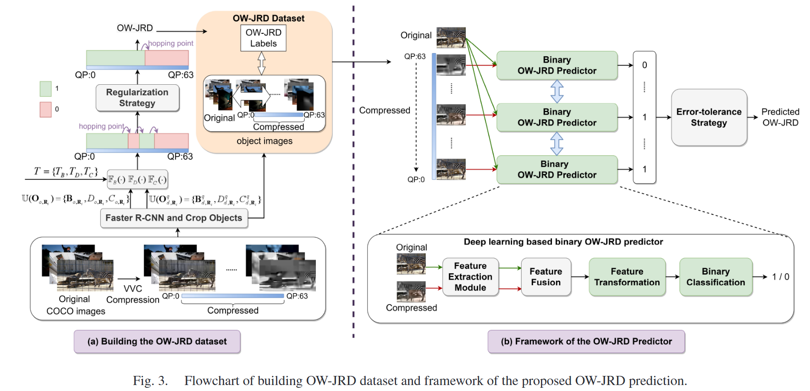

# Learning to Predict Object-Wise Just Recognizable Distortion for Image and Video Compression


[](https://ieeexplore.ieee.org/document/10349945)


Learning to Predict Object-Wise Just Recognizable  Distortion for Image and Video Compression \
[[paper]](https://ieeexplore.ieee.org/document/10349945) [[code]](https://github.com/SYSU-Video/Learning-to-Predict-Object-Wise-Just-Recognizable-Distortion-for-Image-and-Video-Compression) \
[Yun Zhang](https://codec.siat.ac.cn/yunzhang/), Haoqin Lin, [Jing Sun](https://hpcc.siat.ac.cn/homepage/sunjing.html), [Linwei Zhu](https://zhulinweicityu.github.io/), [Sam Kwong](https://scholars.ln.edu.hk/en/persons/sam-tak-wu-kwong) \
*IEEE Transactions on Multimedia (TMM), 2023*

## Abstract
<p align="justify">
Just Recognizable Distortion (JRD) refers to the minimum distortion that notably affects the recognition performance of a machine vision model. If a distortion added to images or videos falls within this JRD threshold, the degradation of the recognition performance will be unnoticeable. Based on this JRD property, it will be useful to Video Coding for Machine (VCM) to minimize the bit rate while maintaining the recognition performance of compressed images. In this study, we propose a deep learning-based JRD prediction model for image and video compression. We first construct a large image dataset of Object-Wise JRD (OW-JRD) containing 29 218 original images with 80 object categories, and each image was compressed into 64 distorted versions using Versatile Video Coding (VVC). Secondly, we analyze the distribution of the OW-JRD, formulate JRD prediction as binary classification problems and propose a deep learning-based OW-JRD prediction framework. Thirdly, we propose a deep learning based binary OW-JRD predictor to predict whether an image object is still detectable or not under different compression levels. Also, we propose an error-tolerance strategy that corrects misclassifications from the binary classifier. Finally, extensive experiments on large JRD image datasets demonstrate that the Mean Absolute Errors (MAEs) of the predicted OW-JRD are 4.90 and 5.92 on different numbers of the classes, which is significantly better than the state-of-the-art JRD prediction model. Moreover, ablation studies on deep network structures, object sizes, features, data padding strategies and image/video coding schemes are presented to validate the effectiveness of the proposed JRD model.
</p>
  
<p align="center">
  
</p>

## Requirements

🧩 This project was trained and tested with:

- 🐍 **Python** 3.10.9

📦 To install required packages, simply run:

```bash
pip install -r requirements.txt
```
## 🗂️ Project Directory Structure
```
Project
├── jsonfiles/
│   ├── objects_infos.json
│   ├── coco80_indices.json
│   ├── JRD_info.json
│   ├── train.json
│   ├── val.json
│   └── test.json
├── data/
│   ├── original/
│   └── distorted/
├── pre_weights/
│   └── pre_efficientnetv2-s.pth
├── pre_weights/
│   └── Eff
│       └── Eff.pth
├── model.py
├── train.py
├── PredictJRD.py
├── my_dataset.py
└── my_utils.py
```

📥 The pretrained EfficientNet weights used for training the proposed OW-JRD prediction model is located in ./pre_weights. And the weights of our trained model are also provided.

## 📊 Dataset
In this work, we construct the **OW-JRD (Object-wise Just Recognizable Distortion) dataset** [[Link]](https://ieee-dataport.org/documents/object-wise-just-recognizable-distortion-dataset), as illustrated below. It consist of original and distorted images of detected objects from the COCO test set. Images and jsonfiles can be downloaded through the link provided above.

## Train
<pre> python train.py --backbone Eff --train_batch_size 32 --lr 0.01 --gpus 0 --device cuda:0 </pre>

## Test
<pre> python PredictJRD.py --train_weights ./train_weights/Eff/Eff.pth </pre>

## 📖 Citation

If you find our work useful or relevant to your research, please kindly cite our paper:

```bibtex
@ARTICLE{zhang2023learning,
  author={Zhang, Yun and Lin, Haoqin and Sun, Jing and Zhu, Linwei and Kwong, Sam},
  journal={IEEE Transactions on Multimedia}, 
  title={Learning to Predict Object-Wise Just Recognizable Distortion for Image and Video Compression}, 
  year={2024},
  volume={26},
  number={},
  pages={5925-5938},
  keywords={Image coding;Machine vision;Distortion;Visualization;Predictive models;Image recognition;Task analysis;Deep learning;just recognizable distortion;object detection;video coding for machine},
  doi={10.1109/TMM.2023.3340882}}
